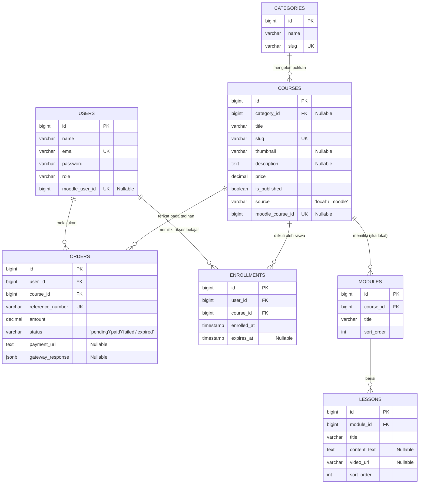
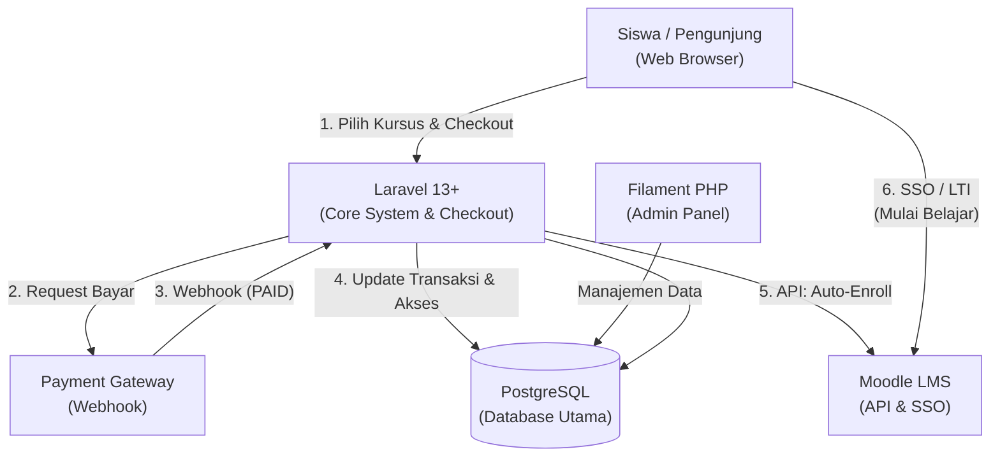

# Ringkasan Proyek: Platform Hybrid E-Learning

Platform ini adalah aplikasi kursus online mandiri yang mengombinasikan kekuatan framework modern untuk pengelolaan bisnis dan kemudahan pengelolaan konten pembelajaran berbasis LMS standar industri.

Aplikasi ini menggunakan pendekatan **Hybrid Content Source**, di mana materi pembelajaran dapat dibuat secara lokal atau didelegasikan langsung ke LMS Moodle secara transparan (*seamless*).

## 1. Stack Teknologi Utama
- **Back-End Framework**: Laravel (v13+) – Menangani logika bisnis, perutean API, integrasi Payment Gateway, dan komunikasi dengan Moodle Web Services.
- **Back-Office & Admin Panel**: Filament PHP – Mempercepat pembuatan dasbor Manajemen Kursus, Monitoring Transaksi, dan sinkronisasi data oleh Admin/Instruktur.
- **Database**: PostgreSQL – Memanfaatkan efisiensi relasi data berskala besar, fitur Full-Text Search untuk pencarian kursus, dan tipe data JSONB untuk log performa tinggi.

## 2. Arsitektur Konten (Hybrid System)
Sistem membagi tipe pelatihan/kursus menjadi dua sumber berdasarkan kolom `source` pada database:
- **Konten Lokal (`source = 'local'`)**: Materi pembelajaran berupa teks HTML dan video (YouTube/Vimeo/S3) dikelola langsung di Laravel menggunakan modifikasi struktur hirarki Glacier (Courses -> Modules -> Lessons). Cocok untuk kursus kilat atau materi sederhana.
- **Konten Moodle (`source = 'moodle'`)**: Laravel hanya berfungsi sebagai etalase toko dan gerbang pembayaran. Materi video, kuis interaktif, pelacakan nilai, dan sertifikasi dikelola di LMS Moodle. Sinkronisasi data katalog menggunakan otomatisasi Laravel Scheduler (Cron Job).

## 3. Alur Pembelian & Pembayaran (Direct Checkout)
Untuk memaksimalkan angka penjualan (*conversion rate*), platform ini memangkas fitur keranjang belanja (*cart*) tradisional dan menerapkan sistem **1 Kursus per Transaksi (Direct Checkout)**.

**Mekanisme Alur Kerja:**
1. **Pilih & Beli**: Pengunjung memilih kursus berbayar dan mengklik tombol "Beli Sekarang".
2. **Instan Checkout**: Laravel langsung membuat draf tagihan di tabel `orders` dan meminta URL pembayaran ke API Payment Gateway (e.g., Midtrans, Xendit, Tripay). Pengguna langsung diarahkan ke halaman pembayaran.
3. **Aktivasi Otomatis (Webhook)**: Setelah pengguna membayar, Payment Gateway mengirimkan notifikasi Webhook ke Laravel. Laravel mengubah status order menjadi `paid` dan menyimpan log respons ke kolom JSONB.
4. **Otomatisasi Hak Akses (Enrollment)**:
   - **Jika kursus Lokal**: Data hak akses langsung ditulis ke tabel `enrollments`.
   - **Jika kursus Moodle**: Laravel menembak API Moodle untuk membuatkan akun siswa (jika belum ada) dan mendaftarkannya (*auto-enroll*) ke kelas terkait di Moodle.

## 4. Pengalaman Pengguna (Seamless SSO)
Saat siswa yang telah membeli kursus Moodle mengklik tombol "Mulai Belajar" di dasbor Laravel:
1. Laravel mengirim permintaan ke API Moodle menggunakan fungsi `auth_userkey_request_login_url`.
2. Moodle mengembalikan tautan masuk sekali pakai (*one-time login token*).
3. Laravel langsung mengarahkan (*redirect*) siswa ke tautan tersebut.
4. **Hasilnya**: Siswa otomatis masuk ke ruang kelas Moodle tanpa perlu melakukan registrasi atau mengetik username & password ulang (Single Sign-On).

## 5. Diagram Entity-Relationship (ERD)

## 6. Diagram Arsitektur Sistem

---

**Catatan Pengembangan:**
Format komponen Filament yang reaktif memudahkan Admin dalam membedakan pengisian kursus lokal dan kursus Moodle hanya dalam satu halaman form terpadu. Dokumen ini dapat dijadikan panduan utama untuk implementasi teknis oleh tim developer.
